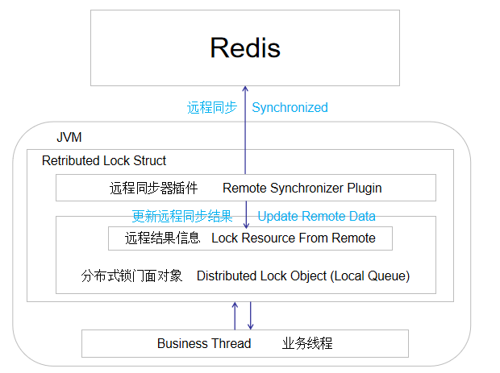

# online-lock

基于redis实现的分布式锁

## 设计结构
该分布式锁，由本地锁管理器（锁门面）和远程同步器两大部件组成。

锁管理器负责将本地请求排队，远程同步器负责与远程服务器同步锁信息（维护锁的申请、保活、释放）。

锁管理器和远程同步器之间采用异步执行的方式，他们之间的耦合点主要在于共享部分数据。

本地锁管理器存在两种状态：
1. 本地锁状态（与本地线程的竞争相关）
2. 资源状态（与远程同步器间数据状态的标记）

**线程状态**
AQS相关的状态，用于AQS锁的竞争
0：未被线程持有
大于1：线程持有锁的次数（重入锁，所以会大于1）

**资源状态**
共有四种状态：
0. 无需进食（没有业务线程等待锁，也没有线程持有锁）
1. 等待投食（业务线程正在等待远程同步器获取锁）
2. 正在进食（远程同步器已投食，业务线程正在处理）
3. 餐后收拾（业务线程在本地释放锁，等待远程同步器清理）

